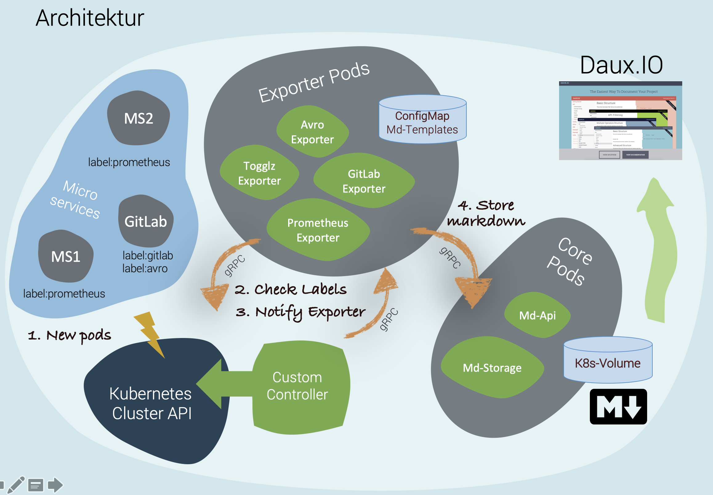

# MaDocK8s - Markdown Kubernetes Framework

## Overview

MaDocK8s is a framework for automatic generation of markdown documentation for microservices. 
The framework consists of core services and expansible components - exporters.
Exporters collect specific information about microservices and add it to md-templates.
The resulting md-files are then sent to storage, where a Kubernetes job generates a documentation web-portal.
Finally, a nginx web-server serves the documentation portal for end users.



### Core Services

**Custom Kubernetes Controller** monitors microservices pods. 
Whenever their configuration changes, the controller notifies exporters. 
Only exporters that are mentioned in microservice definition are notified. 
Set of exporters as well as their configurations are specified using microservices' metadata - annotations. 


**MDStorage** is a service responsible for storing exported md files on a Kubernetes volume.


**Daux.IO jobs**. Controller creates "Daux.IO Generation" job that generates interactive html-based documentation portal from stored md-files.


**Dashboard** is a nginx-driven web-server used to host the documentation portal.


### Exporters

**Exporter** is a service designed to collect a specific piece of information about microservices. 
When notified, exporter collects information, adds it to a md-template and sends the result to storage.

In general case, exporters do not require any specific configuration to perform their task. 
This requires uniform structure and behaviour of microservices, which is not always possible. 
Therefore, exporters support additional configuration. 
The configuration for the exporter may vary and is supplied via `metadata.annotations` of a target microservice. 

Exporters is an extensible component of the framework. 
They are lightweight microservices that serve a single purpose, thus, are easy to implement.

Implemented exporters:
- Environment Exporter: `exporter/env`
- Gitlab Exporter: `exporter/gitlab`
- Prometheus Exporter: `exporter/prometheus`
- Swagger Exporter: `exporter/swagger`
- Version Exporter: `exporter/version`

### Communication

Communication between controller, exporters and storage is based on gRPC with Protobuf.

### Target Microservices

These are microservices that have exporter configurations present in `metadata.annotations` of resource definition.


## Prerequisites

Installed tools:
- minikube
- helm
- docker with docker-compose


## How To:

1. Start minikube:
```
    minikube start --kubernetes-version=1.15.9 --driver=virtualbox
```

- Mandatory for the **first** run. Execute:
```
    helm init 
    chmod u+x ./start.sh ./reset.sh
```

2. Execute `./start.sh`. The script will build all required docker images and install helm charts.

3. Check the dashboard:
- Print url of dashboard to console 
```
    minikube service --url madock8s-dashboard
```


- Open the url in your favourite browser;
- Press "View Documentation".

4. To reset the cluster, execute `./reset.sh`

## Sample App - Target Microservice

There is an example app in `sample-metrics` directory. 
It has configurations for **all** MaDocK8s exporters. 
Check `metadata.annotations` in  `sample-metrics/yaml/deployment.yaml`. 

If you edit the deployment and apply the changes, the updated documentation in the dashboard will be available after a delay of approx. 5 seconds. 

